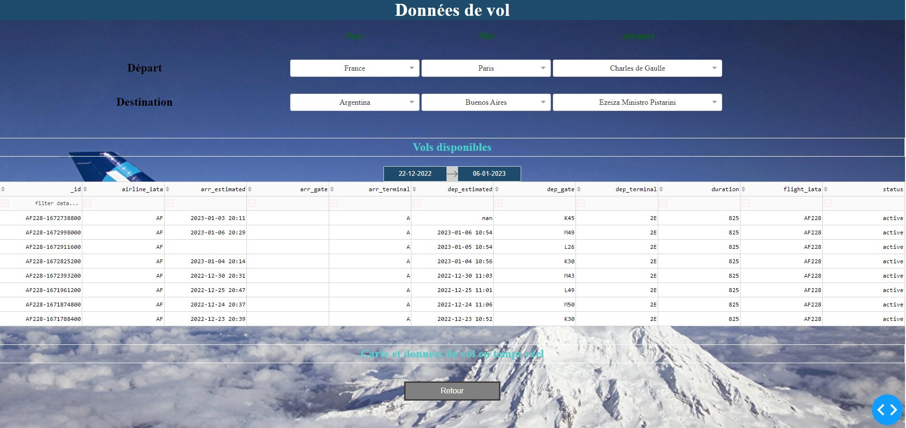

# DST Airlines

## Présentation

Exploitation des données de vols venant des API suivantes:
* AirLabs
* AviationStack
* OpenWeatherMap

Objectifs du projet:
* Cumuler les données de vol en temps réel ainsi que la météo associée
* Sélection et affichage des données en temps réel sur les vols passés ou en cours
* Analyses statistiques sur les compagnies aériennes

Périmètre des données:
* Tous les vols au départ de Paris Charles de Gaulle

## Composants

L'application est composée des éléments suivants:
* Base MongoDB
* Base MySql
* Batchs de chargements des données
* API Flask pour requêter MongoDB
* API Flask pour requêter MySql
* API Dash

## Hébergement

L'application est actuellement hébergée sur une VM Linux Ubuntu chez OVH.  
L'adresse du serveur est 148.59.148.30.  
L'API Flask MongoDB est accessible sur le port 5001.  
L'API Flask MySql est accessible sur le port 5002.   
L'application Dash est accessible à l'adresse suivante:  

http://146.59.146.30:30510

## Dossiers

```
  /DST_Airlines_1/airflow     Dags des chargement des données
  /DST_Airlines_1/doc         Documentations diverses
  /DST_Airlines_1/docker      Images Docker et docker-compose pour les 2 bases de données
  /DST_Airlines_1/json        Fichiers JSON récupérés des API Aviation et Météo
  /DST_Airlines_1/kubernetes  Déploiement des 2 APIs dans minikube
  /DST_Airlines_1/log         Traces des traitements de chargements des données dans les Databases
  /DST_Airlines_1/sql         Scripts de création de la base MySql
  /DST_Airlines_1/src         Exécutables et fichiers sources de l'application  
                              Voir /DST_Airlines_1/src/README.md
  /DST_Airlines_1/setup.sh    Script d'installation et d'initialisation

```
## Installation

### Prérequis

Docker
Minikube
Socat

### Setup

Lancer le script "setup.sh"

Séquence du script:
- Lancement du docker-compose pour les bases mongodb et mysql
- Installation des librairies Python nécessaires aux batchs
- Batch de récupération des données Aviation Stack
- Batch d'initialisation de la base de données Sql
- Batch de récupération des données AirLabs
- Deploiement des APIs api-mongo, api-sql et api-dash dans minikube
- Routage du port 30510 de l'api-dash vers minikube
- Initialisation et démarrage de airflow pour la planification du batch de récupération des données toutes les 15 minutes

## Aperçu du Dashboard

Page d'acceuil:

  
Sélection d'un vol:

  
Visualisation d'un vol:


Statistiques sur les compagnies:

